# QuickStay 🏨


---

## 📋 Table of Contents
- [Project Description](#project-description)
- [Features](#features)
- [Workflow Overview](#workflow-overview)
- [Screenshots](#screenshots)
- [Tech Stack](#tech-stack)
- [File Structure](#file-structure)
- [Getting Started](#getting-started)
- [Usage](#usage)
- [API Overview](#api-overview)
- [FAQ](#faq)
- [Contributing](#contributing)
- [Contact](#contact)
- [Credits](#credits)

---

## ✨ Project Description

**QuickStay** is a full-stack, modern hotel booking platform designed for seamless stays and effortless management. It empowers users to discover, book, and manage hotel rooms with ease, while providing hotel owners with robust tools to manage listings, bookings, and revenue. With a beautiful, responsive UI and real-time features, QuickStay delivers a premium experience for both guests and hosts.

---

## 🚀 Features
- 🔐 Secure user authentication (Clerk)
- 🏨 Browse, search, and filter hotels and rooms
- 📅 Real-time room availability check
- 💳 Integrated Stripe payment gateway
- 📧 Automated booking confirmation emails
- 📊 Admin dashboard for hotel owners
- 🖼️ Multiple room images and amenities
- 📱 Fully responsive, modern UI
- 🌐 RESTful API backend
- ☁️ Cloudinary image uploads

---

## 🗺️ Workflow Overview

Below is a refined workflow of the QuickStay platform, illustrating the user and admin journey, including login, booking, payment, and admin management steps:

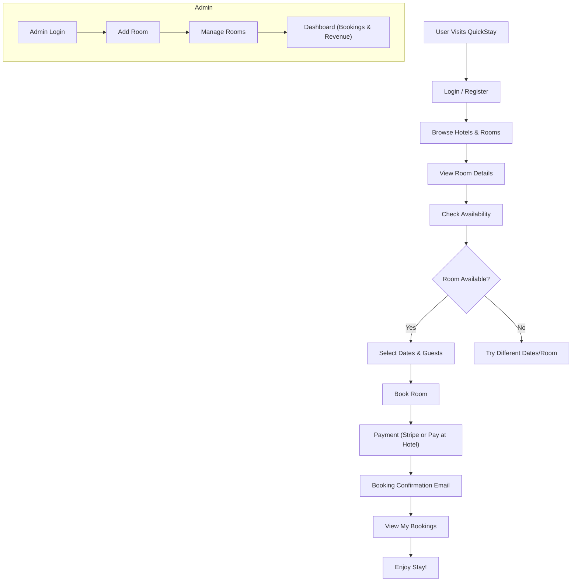

---

## 📸 Screenshots

### 1. Login
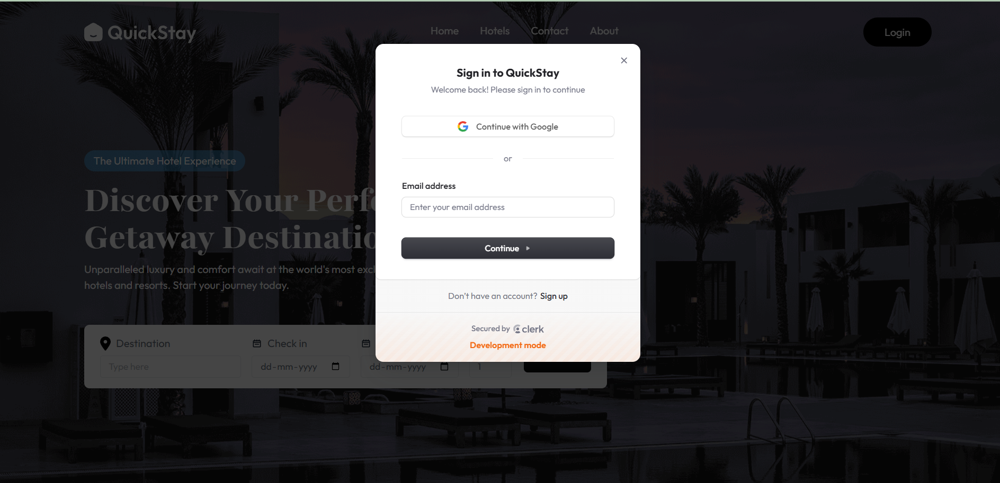

### 2. Landing Page / Hero Section
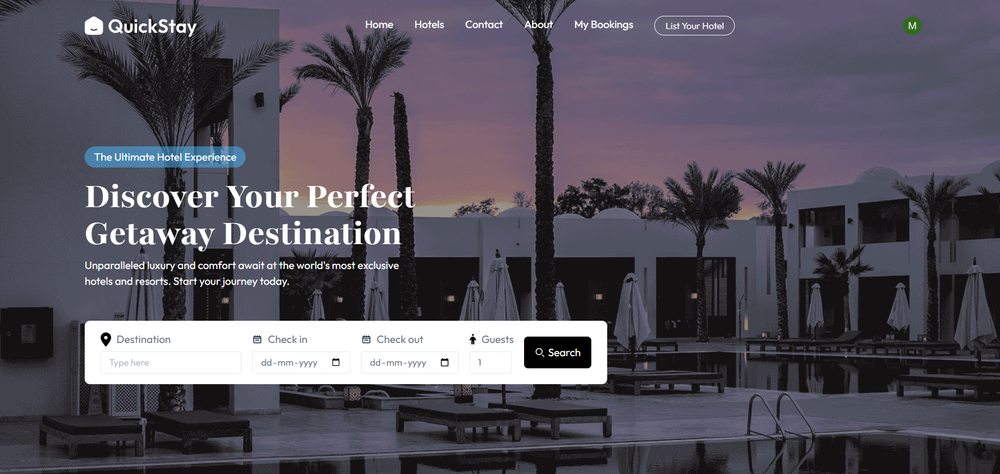

### 3. Featured Destinations
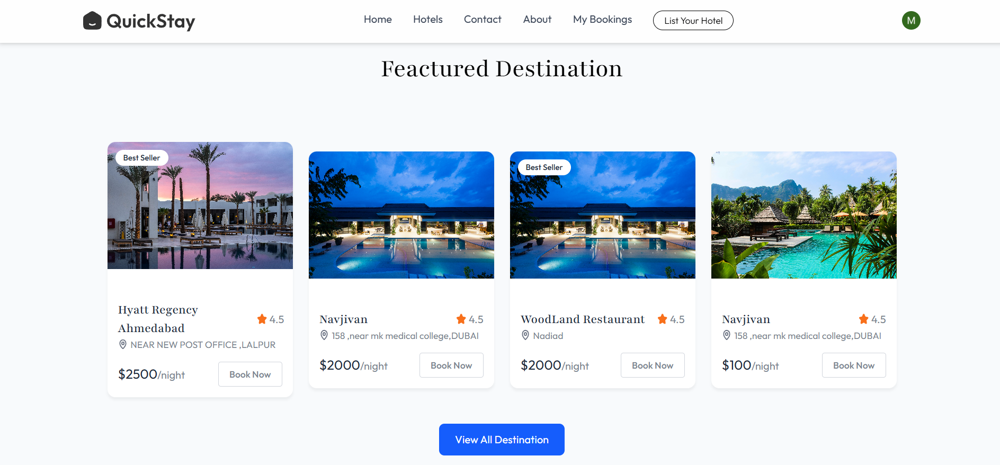

### 4. Recommended Hotels
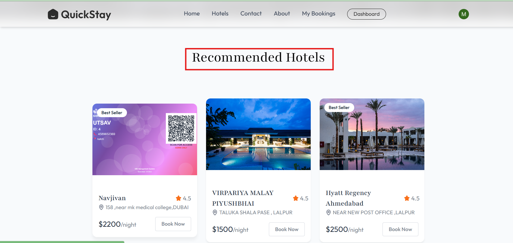

### 5. All Hotels
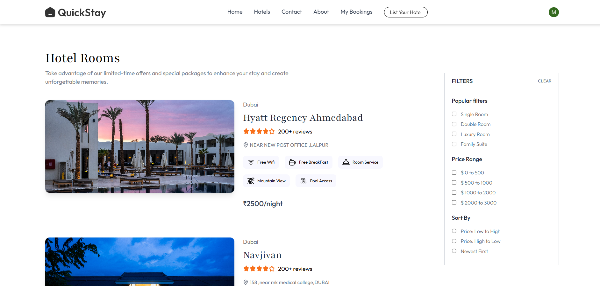

### 6. Room Details
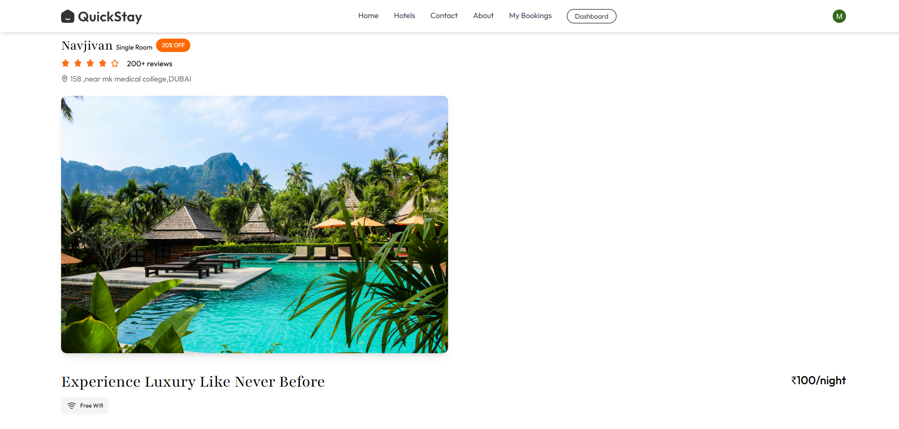

### 7. Room Availability
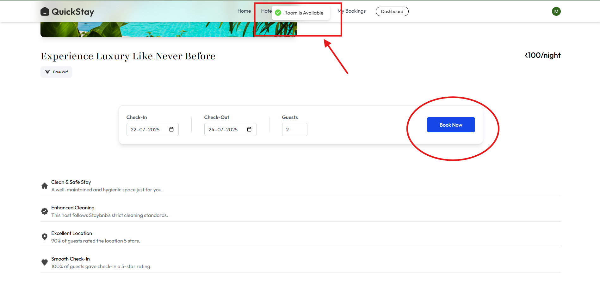
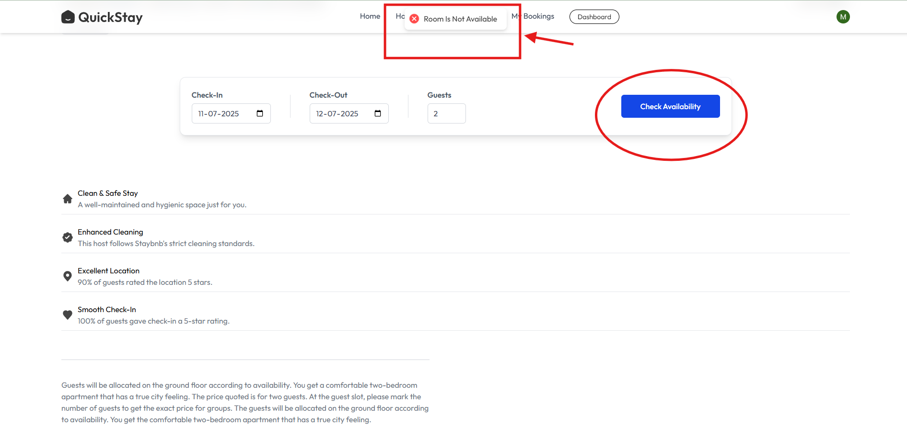

### 8. Booking & Payment
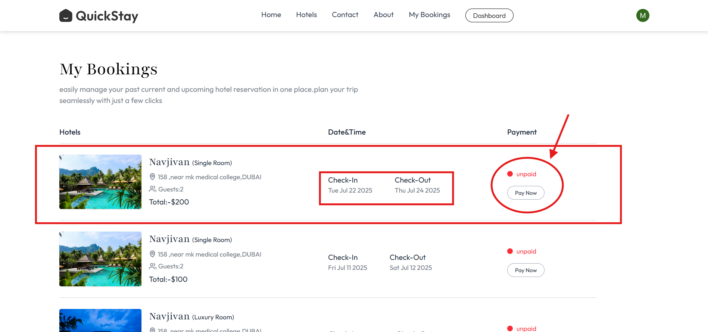
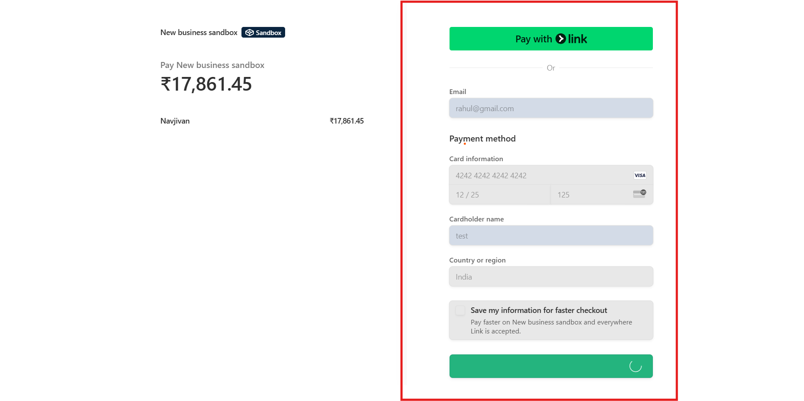
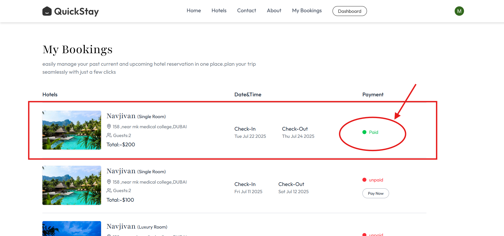

### 9. Booking Confirmation Email
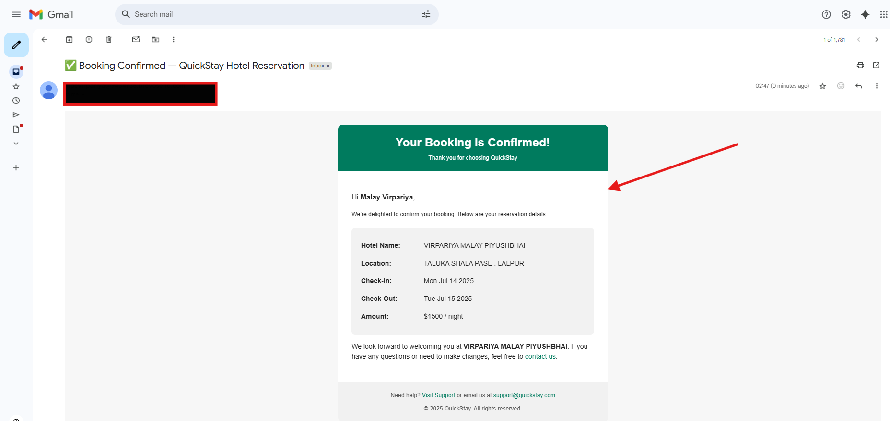

### 10. Admin Dashboard
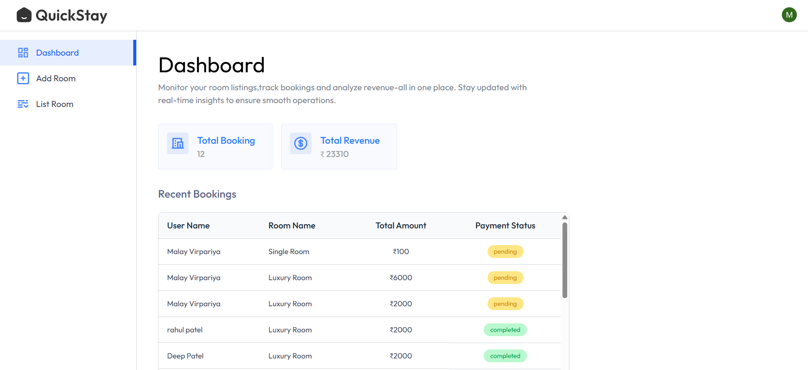
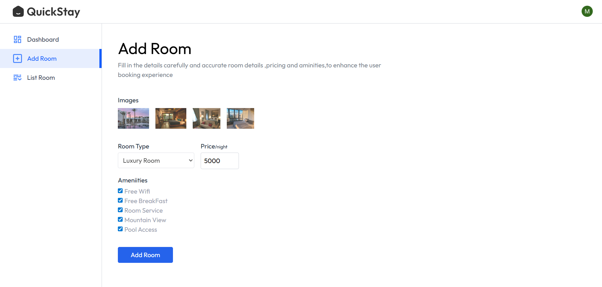
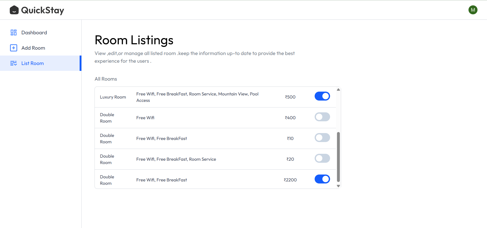

---

## 🛠️ Tech Stack

**Frontend:**
- React (Vite)
- Tailwind CSS
- Clerk (Authentication)
- Axios

**Backend:**
- Node.js & Express
- MongoDB & Mongoose
- Stripe (Payments)
- Cloudinary (Image Uploads)
- Nodemailer (Emails)

**DevOps:**
- Vercel (Deployment)
- Environment Variables for config

---

## 📂 File Structure
```
QuickStay/
  ├── client/
  │   ├── public/
  │   ├── screenshots/           # App screenshots for README
  │   ├── src/
  │   │   ├── assets/            # Images, icons, static assets
  │   │   ├── components/        # Reusable React components
  │   │   ├── context/           # React context providers
  │   │   ├── pages/             # Main app pages (Home, RoomDetails, etc.)
  │   │   └── main.jsx           # App entry point
  │   ├── index.html
  │   └── package.json
  ├── server/
  │   ├── configs/               # Config files (db, cloudinary, etc.)
  │   ├── controllers/           # Express route controllers
  │   ├── middleware/            # Express middleware
  │   ├── models/                # Mongoose models
  │   ├── routes/                # Express routes
  │   ├── server.js              # Server entry point
  │   └── package.json
  └── README.md
```

---

## 🏁 Getting Started

### Prerequisites
- Node.js & npm
- MongoDB

### Installation
1. **Clone the repository:**
   ```bash
   git clone https://github.com/virpariyamalay/QuickStay.git
   cd QuickStay
   ```
2. **Install dependencies:**
   ```bash
   cd client && npm install
   cd ../server && npm install
   ```
3. **Set up environment variables:**
   - Create `.env` files in both `client` and `server` as needed (see `.env.example` if available).
4. **Run the development servers:**
   ```bash
   # In one terminal
   cd server && npm run dev
   # In another terminal
   cd client && npm run dev
   ```

---

## 💡 Usage
- Register or log in as a user or hotel owner
- Browse hotels and rooms
- Check room availability and book
- Pay securely via Stripe or at hotel
- Receive booking confirmation via email
- Hotel owners can add/manage rooms and view bookings

---

## 📚 API Overview
- RESTful endpoints for hotels, rooms, bookings, and users
- JWT-based authentication for protected routes
- Webhooks for Stripe and email notifications

---

## ❓ FAQ
**Q: Is there a mobile app?**  
A: Not yet, but the web app is fully responsive.

---

## 🤝 Contributing
Pull requests are welcome! For major changes, please open an issue first to discuss what you would like to change.

---

## 📬 Contact
For questions or feedback, reach out at [malayvirpariya2026@gmail.com](mailto:malayvirpariya2026@gmail.com).

---

## 🙏 Credits
- [Clerk](https://clerk.dev/) for authentication
- [Stripe](https://stripe.com/) for payments
- [Cloudinary](https://cloudinary.com/) for image hosting
- [Vercel](https://vercel.com/) for deployment
- All open-source contributors 